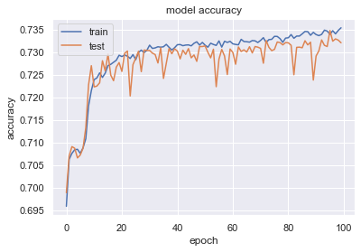
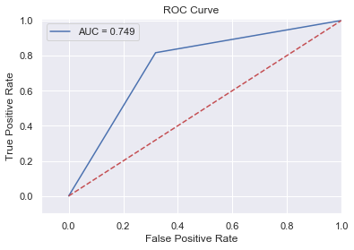

### Snippets of Neural Network Algorithm for Classification of customers for Bank Marketing

#### The data is related with direct marketing campaigns of a Portuguese banking institution. The marketing campaigns were based on phone calls. Often, more than one contact to the same client was required, in order to access if the product (bank term deposit) would be ('yes') or not ('no') subscribed
### Objective : The classification goal is to predict if the client will subscribe (yes/no) a term deposit (variable y).

```python
import numpy as np
import pandas as pd
import matplotlib.pyplot as plt
import seaborn as sns
%matplotlib inline
import warnings  
warnings.filterwarnings('ignore')
```


```python
df = pd.read_csv('bank-additional-full.csv',sep=";")
```


```python
df.head(20)
```


<div>
<style scoped>
    .dataframe tbody tr th:only-of-type {
        vertical-align: middle;
    }

    .dataframe tbody tr th {
        vertical-align: top;
    }

    .dataframe thead th {
        text-align: right;
    }
</style>
<table border="1" class="dataframe">
  <thead>
    <tr style="text-align: right;">
      <th></th>
      <th>age</th>
      <th>job</th>
      <th>marital</th>
      <th>education</th>
      <th>default</th>
      <th>housing</th>
      <th>loan</th>
      <th>contact</th>
      <th>month</th>
      <th>day_of_week</th>
      <th>...</th>
      <th>campaign</th>
      <th>pdays</th>
      <th>previous</th>
      <th>poutcome</th>
      <th>emp.var.rate</th>
      <th>cons.price.idx</th>
      <th>cons.conf.idx</th>
      <th>euribor3m</th>
      <th>nr.employed</th>
      <th>y</th>
    </tr>
  </thead>
  <tbody>
    <tr>
      <th>0</th>
      <td>56</td>
      <td>housemaid</td>
      <td>married</td>
      <td>basic.4y</td>
      <td>no</td>
      <td>no</td>
      <td>no</td>
      <td>telephone</td>
      <td>may</td>
      <td>mon</td>
      <td>...</td>
      <td>1</td>
      <td>999</td>
      <td>0</td>
      <td>nonexistent</td>
      <td>1.1</td>
      <td>93.994</td>
      <td>-36.4</td>
      <td>4.857</td>
      <td>5191.0</td>
      <td>no</td>
    </tr>
    <tr>
      <th>1</th>
      <td>57</td>
      <td>services</td>
      <td>married</td>
      <td>high.school</td>
      <td>unknown</td>
      <td>no</td>
      <td>no</td>
      <td>telephone</td>
      <td>may</td>
      <td>mon</td>
      <td>...</td>
      <td>1</td>
      <td>999</td>
      <td>0</td>
      <td>nonexistent</td>
      <td>1.1</td>
      <td>93.994</td>
      <td>-36.4</td>
      <td>4.857</td>
      <td>5191.0</td>
      <td>no</td>
    </tr>
    <tr>
      <th>2</th>
      <td>37</td>
      <td>services</td>
      <td>married</td>
      <td>high.school</td>
      <td>no</td>
      <td>yes</td>
      <td>no</td>
      <td>telephone</td>
      <td>may</td>
      <td>mon</td>
      <td>...</td>
      <td>1</td>
      <td>999</td>
      <td>0</td>
      <td>nonexistent</td>
      <td>1.1</td>
      <td>93.994</td>
      <td>-36.4</td>
      <td>4.857</td>
      <td>5191.0</td>
      <td>no</td>
    </tr>
    <tr>
      <th>3</th>
      <td>40</td>
      <td>admin.</td>
      <td>married</td>
      <td>basic.6y</td>
      <td>no</td>
      <td>no</td>
      <td>no</td>
      <td>telephone</td>
      <td>may</td>
      <td>mon</td>
      <td>...</td>
      <td>1</td>
      <td>999</td>
      <td>0</td>
      <td>nonexistent</td>
      <td>1.1</td>
      <td>93.994</td>
      <td>-36.4</td>
      <td>4.857</td>
      <td>5191.0</td>
      <td>no</td>
    </tr>
    <tr>
      <th>4</th>
      <td>56</td>
      <td>services</td>
      <td>married</td>
      <td>high.school</td>
      <td>no</td>
      <td>no</td>
      <td>yes</td>
      <td>telephone</td>
      <td>may</td>
      <td>mon</td>
      <td>...</td>
      <td>1</td>
      <td>999</td>
      <td>0</td>
      <td>nonexistent</td>
      <td>1.1</td>
      <td>93.994</td>
      <td>-36.4</td>
      <td>4.857</td>
      <td>5191.0</td>
      <td>no</td>
    </tr>
    <tr>
      <th>5</th>
      <td>45</td>
      <td>services</td>
      <td>married</td>
      <td>basic.9y</td>
      <td>unknown</td>
      <td>no</td>
      <td>no</td>
      <td>telephone</td>
      <td>may</td>
      <td>mon</td>
      <td>...</td>
      <td>1</td>
      <td>999</td>
      <td>0</td>
      <td>nonexistent</td>
      <td>1.1</td>
      <td>93.994</td>
      <td>-36.4</td>
      <td>4.857</td>
      <td>5191.0</td>
      <td>no</td>
    </tr>
    <tr>
      <th>6</th>
      <td>59</td>
      <td>admin.</td>
      <td>married</td>
      <td>professional.course</td>
      <td>no</td>
      <td>no</td>
      <td>no</td>
      <td>telephone</td>
      <td>may</td>
      <td>mon</td>
      <td>...</td>
      <td>1</td>
      <td>999</td>
      <td>0</td>
      <td>nonexistent</td>
      <td>1.1</td>
      <td>93.994</td>
      <td>-36.4</td>
      <td>4.857</td>
      <td>5191.0</td>
      <td>no</td>
    </tr>
    <tr>
      <th>7</th>
      <td>41</td>
      <td>blue-collar</td>
      <td>married</td>
      <td>unknown</td>
      <td>unknown</td>
      <td>no</td>
      <td>no</td>
      <td>telephone</td>
      <td>may</td>
      <td>mon</td>
      <td>...</td>
      <td>1</td>
      <td>999</td>
      <td>0</td>
      <td>nonexistent</td>
      <td>1.1</td>
      <td>93.994</td>
      <td>-36.4</td>
      <td>4.857</td>
      <td>5191.0</td>
      <td>no</td>
    </tr>
    <tr>
      <th>8</th>
      <td>24</td>
      <td>technician</td>
      <td>single</td>
      <td>professional.course</td>
      <td>no</td>
      <td>yes</td>
      <td>no</td>
      <td>telephone</td>
      <td>may</td>
      <td>mon</td>
      <td>...</td>
      <td>1</td>
      <td>999</td>
      <td>0</td>
      <td>nonexistent</td>
      <td>1.1</td>
      <td>93.994</td>
      <td>-36.4</td>
      <td>4.857</td>
      <td>5191.0</td>
      <td>no</td>
    </tr>
    <tr>
      <th>9</th>
      <td>25</td>
      <td>services</td>
      <td>single</td>
      <td>high.school</td>
      <td>no</td>
      <td>yes</td>
      <td>no</td>
      <td>telephone</td>
      <td>may</td>
      <td>mon</td>
      <td>...</td>
      <td>1</td>
      <td>999</td>
      <td>0</td>
      <td>nonexistent</td>
      <td>1.1</td>
      <td>93.994</td>
      <td>-36.4</td>
      <td>4.857</td>
      <td>5191.0</td>
      <td>no</td>
    </tr>
    <tr>
      <th>10</th>
      <td>41</td>
      <td>blue-collar</td>
      <td>married</td>
      <td>unknown</td>
      <td>unknown</td>
      <td>no</td>
      <td>no</td>
      <td>telephone</td>
      <td>may</td>
      <td>mon</td>
      <td>...</td>
      <td>1</td>
      <td>999</td>
      <td>0</td>
      <td>nonexistent</td>
      <td>1.1</td>
      <td>93.994</td>
      <td>-36.4</td>
      <td>4.857</td>
      <td>5191.0</td>
      <td>no</td>
    </tr>
    <tr>
      <th>11</th>
      <td>25</td>
      <td>services</td>
      <td>single</td>
      <td>high.school</td>
      <td>no</td>
      <td>yes</td>
      <td>no</td>
      <td>telephone</td>
      <td>may</td>
      <td>mon</td>
      <td>...</td>
      <td>1</td>
      <td>999</td>
      <td>0</td>
      <td>nonexistent</td>
      <td>1.1</td>
      <td>93.994</td>
      <td>-36.4</td>
      <td>4.857</td>
      <td>5191.0</td>
      <td>no</td>
    </tr>
    <tr>
      <th>12</th>
      <td>29</td>
      <td>blue-collar</td>
      <td>single</td>
      <td>high.school</td>
      <td>no</td>
      <td>no</td>
      <td>yes</td>
      <td>telephone</td>
      <td>may</td>
      <td>mon</td>
      <td>...</td>
      <td>1</td>
      <td>999</td>
      <td>0</td>
      <td>nonexistent</td>
      <td>1.1</td>
      <td>93.994</td>
      <td>-36.4</td>
      <td>4.857</td>
      <td>5191.0</td>
      <td>no</td>
    </tr>
    <tr>
      <th>13</th>
      <td>57</td>
      <td>housemaid</td>
      <td>divorced</td>
      <td>basic.4y</td>
      <td>no</td>
      <td>yes</td>
      <td>no</td>
      <td>telephone</td>
      <td>may</td>
      <td>mon</td>
      <td>...</td>
      <td>1</td>
      <td>999</td>
      <td>0</td>
      <td>nonexistent</td>
      <td>1.1</td>
      <td>93.994</td>
      <td>-36.4</td>
      <td>4.857</td>
      <td>5191.0</td>
      <td>no</td>
    </tr>
    <tr>
      <th>14</th>
      <td>35</td>
      <td>blue-collar</td>
      <td>married</td>
      <td>basic.6y</td>
      <td>no</td>
      <td>yes</td>
      <td>no</td>
      <td>telephone</td>
      <td>may</td>
      <td>mon</td>
      <td>...</td>
      <td>1</td>
      <td>999</td>
      <td>0</td>
      <td>nonexistent</td>
      <td>1.1</td>
      <td>93.994</td>
      <td>-36.4</td>
      <td>4.857</td>
      <td>5191.0</td>
      <td>no</td>
    </tr>
    <tr>
      <th>15</th>
      <td>54</td>
      <td>retired</td>
      <td>married</td>
      <td>basic.9y</td>
      <td>unknown</td>
      <td>yes</td>
      <td>yes</td>
      <td>telephone</td>
      <td>may</td>
      <td>mon</td>
      <td>...</td>
      <td>1</td>
      <td>999</td>
      <td>0</td>
      <td>nonexistent</td>
      <td>1.1</td>
      <td>93.994</td>
      <td>-36.4</td>
      <td>4.857</td>
      <td>5191.0</td>
      <td>no</td>
    </tr>
    <tr>
      <th>16</th>
      <td>35</td>
      <td>blue-collar</td>
      <td>married</td>
      <td>basic.6y</td>
      <td>no</td>
      <td>yes</td>
      <td>no</td>
      <td>telephone</td>
      <td>may</td>
      <td>mon</td>
      <td>...</td>
      <td>1</td>
      <td>999</td>
      <td>0</td>
      <td>nonexistent</td>
      <td>1.1</td>
      <td>93.994</td>
      <td>-36.4</td>
      <td>4.857</td>
      <td>5191.0</td>
      <td>no</td>
    </tr>
    <tr>
      <th>17</th>
      <td>46</td>
      <td>blue-collar</td>
      <td>married</td>
      <td>basic.6y</td>
      <td>unknown</td>
      <td>yes</td>
      <td>yes</td>
      <td>telephone</td>
      <td>may</td>
      <td>mon</td>
      <td>...</td>
      <td>1</td>
      <td>999</td>
      <td>0</td>
      <td>nonexistent</td>
      <td>1.1</td>
      <td>93.994</td>
      <td>-36.4</td>
      <td>4.857</td>
      <td>5191.0</td>
      <td>no</td>
    </tr>
    <tr>
      <th>18</th>
      <td>50</td>
      <td>blue-collar</td>
      <td>married</td>
      <td>basic.9y</td>
      <td>no</td>
      <td>yes</td>
      <td>yes</td>
      <td>telephone</td>
      <td>may</td>
      <td>mon</td>
      <td>...</td>
      <td>1</td>
      <td>999</td>
      <td>0</td>
      <td>nonexistent</td>
      <td>1.1</td>
      <td>93.994</td>
      <td>-36.4</td>
      <td>4.857</td>
      <td>5191.0</td>
      <td>no</td>
    </tr>
    <tr>
      <th>19</th>
      <td>39</td>
      <td>management</td>
      <td>single</td>
      <td>basic.9y</td>
      <td>unknown</td>
      <td>no</td>
      <td>no</td>
      <td>telephone</td>
      <td>may</td>
      <td>mon</td>
      <td>...</td>
      <td>1</td>
      <td>999</td>
      <td>0</td>
      <td>nonexistent</td>
      <td>1.1</td>
      <td>93.994</td>
      <td>-36.4</td>
      <td>4.857</td>
      <td>5191.0</td>
      <td>no</td>
    </tr>
  </tbody>
</table>
<p>20 rows × 21 columns</p>
</div>


```python
df['y'].value_counts()
```


    no     36548
    yes     4640
    Name: y, dtype: int64


```python
df.describe()
```


<div>
<style scoped>
    .dataframe tbody tr th:only-of-type {
        vertical-align: middle;
    }

    .dataframe tbody tr th {
        vertical-align: top;
    }

    .dataframe thead th {
        text-align: right;
    }
</style>
<table border="1" class="dataframe">
  <thead>
    <tr style="text-align: right;">
      <th></th>
      <th>age</th>
      <th>duration</th>
      <th>campaign</th>
      <th>pdays</th>
      <th>previous</th>
      <th>emp.var.rate</th>
      <th>cons.price.idx</th>
      <th>cons.conf.idx</th>
      <th>euribor3m</th>
      <th>nr.employed</th>
    </tr>
  </thead>
  <tbody>
    <tr>
      <th>count</th>
      <td>41188.00000</td>
      <td>41188.000000</td>
      <td>41188.000000</td>
      <td>41188.000000</td>
      <td>41188.000000</td>
      <td>41188.000000</td>
      <td>41188.000000</td>
      <td>41188.000000</td>
      <td>41188.000000</td>
      <td>41188.000000</td>
    </tr>
    <tr>
      <th>mean</th>
      <td>40.02406</td>
      <td>258.285010</td>
      <td>2.567593</td>
      <td>962.475454</td>
      <td>0.172963</td>
      <td>0.081886</td>
      <td>93.575664</td>
      <td>-40.502600</td>
      <td>3.621291</td>
      <td>5167.035911</td>
    </tr>
    <tr>
      <th>std</th>
      <td>10.42125</td>
      <td>259.279249</td>
      <td>2.770014</td>
      <td>186.910907</td>
      <td>0.494901</td>
      <td>1.570960</td>
      <td>0.578840</td>
      <td>4.628198</td>
      <td>1.734447</td>
      <td>72.251528</td>
    </tr>
    <tr>
      <th>min</th>
      <td>17.00000</td>
      <td>0.000000</td>
      <td>1.000000</td>
      <td>0.000000</td>
      <td>0.000000</td>
      <td>-3.400000</td>
      <td>92.201000</td>
      <td>-50.800000</td>
      <td>0.634000</td>
      <td>4963.600000</td>
    </tr>
    <tr>
      <th>25%</th>
      <td>32.00000</td>
      <td>102.000000</td>
      <td>1.000000</td>
      <td>999.000000</td>
      <td>0.000000</td>
      <td>-1.800000</td>
      <td>93.075000</td>
      <td>-42.700000</td>
      <td>1.344000</td>
      <td>5099.100000</td>
    </tr>
    <tr>
      <th>50%</th>
      <td>38.00000</td>
      <td>180.000000</td>
      <td>2.000000</td>
      <td>999.000000</td>
      <td>0.000000</td>
      <td>1.100000</td>
      <td>93.749000</td>
      <td>-41.800000</td>
      <td>4.857000</td>
      <td>5191.000000</td>
    </tr>
    <tr>
      <th>75%</th>
      <td>47.00000</td>
      <td>319.000000</td>
      <td>3.000000</td>
      <td>999.000000</td>
      <td>0.000000</td>
      <td>1.400000</td>
      <td>93.994000</td>
      <td>-36.400000</td>
      <td>4.961000</td>
      <td>5228.100000</td>
    </tr>
    <tr>
      <th>max</th>
      <td>98.00000</td>
      <td>4918.000000</td>
      <td>56.000000</td>
      <td>999.000000</td>
      <td>7.000000</td>
      <td>1.400000</td>
      <td>94.767000</td>
      <td>-26.900000</td>
      <td>5.045000</td>
      <td>5228.100000</td>
    </tr>
  </tbody>
</table>
</div>


```python
df.info()
```

    <class 'pandas.core.frame.DataFrame'>
    RangeIndex: 41188 entries, 0 to 41187
    Data columns (total 21 columns):
     #   Column          Non-Null Count  Dtype  
    ---  ------          --------------  -----  
     0   age             41188 non-null  int64  
     1   job             41188 non-null  object 
     2   marital         41188 non-null  object 
     3   education       41188 non-null  object 
     4   default         41188 non-null  object 
     5   housing         41188 non-null  object 
     6   loan            41188 non-null  object 
     7   contact         41188 non-null  object 
     8   month           41188 non-null  object 
     9   day_of_week     41188 non-null  object 
     10  duration        41188 non-null  int64  
     11  campaign        41188 non-null  int64  
     12  pdays           41188 non-null  int64  
     13  previous        41188 non-null  int64  
     14  poutcome        41188 non-null  object 
     15  emp.var.rate    41188 non-null  float64
     16  cons.price.idx  41188 non-null  float64
     17  cons.conf.idx   41188 non-null  float64
     18  euribor3m       41188 non-null  float64
     19  nr.employed     41188 non-null  float64
     20  y               41188 non-null  object 
    dtypes: float64(5), int64(5), object(11)
    memory usage: 6.6+ MB
    


```python
df.columns
```


    Index(['age', 'job', 'marital', 'education', 'default', 'housing', 'loan',
           'contact', 'month', 'day_of_week', 'duration', 'campaign', 'pdays',
           'previous', 'poutcome', 'emp.var.rate', 'cons.price.idx',
           'cons.conf.idx', 'euribor3m', 'nr.employed', 'y'],
          dtype='object')


```python
df['y'].value_counts()
```


    no     36548
    yes     4640
    Name: y, dtype: int64


**Preprocessing the data**


```python
df["job"] = df["job"].astype('category')
df["marital"] = df["marital"].astype('category')
df["education"] = df["education"].astype('category')
df["default"] = df["default"].astype('category')
df["housing"] = df["housing"].astype('category')
df["loan"] = df["loan"].astype('category')
df["contact"] = df["contact"].astype('category')
df["month"] = df["month"].astype('category')
df["day_of_week"] = df["day_of_week"].astype('category')
df["poutcome"] = df["poutcome"].astype('category')
df["y"] = df["y"].astype('category')
df.info()
```

    <class 'pandas.core.frame.DataFrame'>
    RangeIndex: 41188 entries, 0 to 41187
    Data columns (total 21 columns):
     #   Column          Non-Null Count  Dtype   
    ---  ------          --------------  -----   
     0   age             41188 non-null  int64   
     1   job             41188 non-null  category
     2   marital         41188 non-null  category
     3   education       41188 non-null  category
     4   default         41188 non-null  category
     5   housing         41188 non-null  category
     6   loan            41188 non-null  category
     7   contact         41188 non-null  category
     8   month           41188 non-null  category
     9   day_of_week     41188 non-null  category
     10  duration        41188 non-null  int64   
     11  campaign        41188 non-null  int64   
     12  pdays           41188 non-null  int64   
     13  previous        41188 non-null  int64   
     14  poutcome        41188 non-null  category
     15  emp.var.rate    41188 non-null  float64 
     16  cons.price.idx  41188 non-null  float64 
     17  cons.conf.idx   41188 non-null  float64 
     18  euribor3m       41188 non-null  float64 
     19  nr.employed     41188 non-null  float64 
     20  y               41188 non-null  category
    dtypes: category(11), float64(5), int64(5)
    memory usage: 3.6 MB
    


```python
from sklearn.preprocessing import LabelEncoder
labelencoder = LabelEncoder()
df['y'] = labelencoder.fit_transform(df['y'])
```

# Upsampling the dependent variable


```python
from sklearn.utils import resample

# Separate majority and minority classes
df_majority = df[df.y==0]
df_minority = df[df.y==1]
 
# Upsample minority class
df_minority_upsampled = resample(df_minority, 
                                 replace=True,     # sample with replacement
                                 n_samples=36548,    # to match majority class
                                 random_state=123) # reproducible results
 
# Combine majority class with upsampled minority class
df_upsampled = pd.concat([df_majority, df_minority_upsampled])
 
# Display new class counts
df_upsampled.y.value_counts()
```


    1    36548
    0    36548
    Name: y, dtype: int64


```python
df_upsampled
```


<div>
<style scoped>
    .dataframe tbody tr th:only-of-type {
        vertical-align: middle;
    }

    .dataframe tbody tr th {
        vertical-align: top;
    }

    .dataframe thead th {
        text-align: right;
    }
</style>
<table border="1" class="dataframe">
  <thead>
    <tr style="text-align: right;">
      <th></th>
      <th>age</th>
      <th>job</th>
      <th>marital</th>
      <th>education</th>
      <th>default</th>
      <th>housing</th>
      <th>loan</th>
      <th>contact</th>
      <th>month</th>
      <th>day_of_week</th>
      <th>...</th>
      <th>campaign</th>
      <th>pdays</th>
      <th>previous</th>
      <th>poutcome</th>
      <th>emp.var.rate</th>
      <th>cons.price.idx</th>
      <th>cons.conf.idx</th>
      <th>euribor3m</th>
      <th>nr.employed</th>
      <th>y</th>
    </tr>
  </thead>
  <tbody>
    <tr>
      <th>0</th>
      <td>56</td>
      <td>housemaid</td>
      <td>married</td>
      <td>basic.4y</td>
      <td>no</td>
      <td>no</td>
      <td>no</td>
      <td>telephone</td>
      <td>may</td>
      <td>mon</td>
      <td>...</td>
      <td>1</td>
      <td>999</td>
      <td>0</td>
      <td>nonexistent</td>
      <td>1.1</td>
      <td>93.994</td>
      <td>-36.4</td>
      <td>4.857</td>
      <td>5191.0</td>
      <td>0</td>
    </tr>
    <tr>
      <th>1</th>
      <td>57</td>
      <td>services</td>
      <td>married</td>
      <td>high.school</td>
      <td>unknown</td>
      <td>no</td>
      <td>no</td>
      <td>telephone</td>
      <td>may</td>
      <td>mon</td>
      <td>...</td>
      <td>1</td>
      <td>999</td>
      <td>0</td>
      <td>nonexistent</td>
      <td>1.1</td>
      <td>93.994</td>
      <td>-36.4</td>
      <td>4.857</td>
      <td>5191.0</td>
      <td>0</td>
    </tr>
    <tr>
      <th>2</th>
      <td>37</td>
      <td>services</td>
      <td>married</td>
      <td>high.school</td>
      <td>no</td>
      <td>yes</td>
      <td>no</td>
      <td>telephone</td>
      <td>may</td>
      <td>mon</td>
      <td>...</td>
      <td>1</td>
      <td>999</td>
      <td>0</td>
      <td>nonexistent</td>
      <td>1.1</td>
      <td>93.994</td>
      <td>-36.4</td>
      <td>4.857</td>
      <td>5191.0</td>
      <td>0</td>
    </tr>
    <tr>
      <th>3</th>
      <td>40</td>
      <td>admin.</td>
      <td>married</td>
      <td>basic.6y</td>
      <td>no</td>
      <td>no</td>
      <td>no</td>
      <td>telephone</td>
      <td>may</td>
      <td>mon</td>
      <td>...</td>
      <td>1</td>
      <td>999</td>
      <td>0</td>
      <td>nonexistent</td>
      <td>1.1</td>
      <td>93.994</td>
      <td>-36.4</td>
      <td>4.857</td>
      <td>5191.0</td>
      <td>0</td>
    </tr>
    <tr>
      <th>4</th>
      <td>56</td>
      <td>services</td>
      <td>married</td>
      <td>high.school</td>
      <td>no</td>
      <td>no</td>
      <td>yes</td>
      <td>telephone</td>
      <td>may</td>
      <td>mon</td>
      <td>...</td>
      <td>1</td>
      <td>999</td>
      <td>0</td>
      <td>nonexistent</td>
      <td>1.1</td>
      <td>93.994</td>
      <td>-36.4</td>
      <td>4.857</td>
      <td>5191.0</td>
      <td>0</td>
    </tr>
    <tr>
      <th>...</th>
      <td>...</td>
      <td>...</td>
      <td>...</td>
      <td>...</td>
      <td>...</td>
      <td>...</td>
      <td>...</td>
      <td>...</td>
      <td>...</td>
      <td>...</td>
      <td>...</td>
      <td>...</td>
      <td>...</td>
      <td>...</td>
      <td>...</td>
      <td>...</td>
      <td>...</td>
      <td>...</td>
      <td>...</td>
      <td>...</td>
      <td>...</td>
    </tr>
    <tr>
      <th>36577</th>
      <td>33</td>
      <td>management</td>
      <td>divorced</td>
      <td>university.degree</td>
      <td>no</td>
      <td>yes</td>
      <td>no</td>
      <td>cellular</td>
      <td>jun</td>
      <td>wed</td>
      <td>...</td>
      <td>1</td>
      <td>999</td>
      <td>0</td>
      <td>nonexistent</td>
      <td>-2.9</td>
      <td>92.963</td>
      <td>-40.8</td>
      <td>1.260</td>
      <td>5076.2</td>
      <td>1</td>
    </tr>
    <tr>
      <th>37277</th>
      <td>38</td>
      <td>admin.</td>
      <td>single</td>
      <td>high.school</td>
      <td>no</td>
      <td>yes</td>
      <td>yes</td>
      <td>cellular</td>
      <td>aug</td>
      <td>mon</td>
      <td>...</td>
      <td>1</td>
      <td>999</td>
      <td>0</td>
      <td>nonexistent</td>
      <td>-2.9</td>
      <td>92.201</td>
      <td>-31.4</td>
      <td>0.884</td>
      <td>5076.2</td>
      <td>1</td>
    </tr>
    <tr>
      <th>9157</th>
      <td>52</td>
      <td>self-employed</td>
      <td>married</td>
      <td>basic.4y</td>
      <td>unknown</td>
      <td>no</td>
      <td>yes</td>
      <td>telephone</td>
      <td>jun</td>
      <td>fri</td>
      <td>...</td>
      <td>2</td>
      <td>999</td>
      <td>0</td>
      <td>nonexistent</td>
      <td>1.4</td>
      <td>94.465</td>
      <td>-41.8</td>
      <td>4.967</td>
      <td>5228.1</td>
      <td>1</td>
    </tr>
    <tr>
      <th>36369</th>
      <td>25</td>
      <td>admin.</td>
      <td>single</td>
      <td>university.degree</td>
      <td>no</td>
      <td>no</td>
      <td>no</td>
      <td>cellular</td>
      <td>jun</td>
      <td>tue</td>
      <td>...</td>
      <td>1</td>
      <td>999</td>
      <td>0</td>
      <td>nonexistent</td>
      <td>-2.9</td>
      <td>92.963</td>
      <td>-40.8</td>
      <td>1.262</td>
      <td>5076.2</td>
      <td>1</td>
    </tr>
    <tr>
      <th>40263</th>
      <td>32</td>
      <td>admin.</td>
      <td>single</td>
      <td>university.degree</td>
      <td>no</td>
      <td>no</td>
      <td>no</td>
      <td>cellular</td>
      <td>jul</td>
      <td>tue</td>
      <td>...</td>
      <td>1</td>
      <td>999</td>
      <td>0</td>
      <td>nonexistent</td>
      <td>-1.7</td>
      <td>94.215</td>
      <td>-40.3</td>
      <td>0.893</td>
      <td>4991.6</td>
      <td>1</td>
    </tr>
  </tbody>
</table>
<p>73096 rows × 21 columns</p>
</div>


```python
df1 = df.drop(columns = ['y'])
```


```python
features = ['age','duration','campaign','pdays','previous','emp.var.rate','cons.price.idx','cons.conf.idx','euribor3m','nr.employed']
```


```python
from sklearn.preprocessing import StandardScaler,Normalizer
sc = StandardScaler()
Norm = Normalizer()
df1 = sc.fit_transform(df_upsampled[features])
#X = Norm.fit_transform(X[features])
```


```python
df_upsampled.dtypes
```


    age                  int64
    job               category
    marital           category
    education         category
    default           category
    housing           category
    loan              category
    contact           category
    month             category
    day_of_week       category
    duration             int64
    campaign             int64
    pdays                int64
    previous             int64
    poutcome          category
    emp.var.rate       float64
    cons.price.idx     float64
    cons.conf.idx      float64
    euribor3m          float64
    nr.employed        float64
    y                    int32
    dtype: object


```python
X = df1
X
```


    array([[ 1.30597253, -0.35023047, -0.56714014, ...,  0.71345043,
             1.00007526,  0.6361662 ],
           [ 1.38947829, -0.65995294, -0.56714014, ...,  0.71345043,
             1.00007526,  0.6361662 ],
           [-0.28063699, -0.44701874, -0.56714014, ...,  0.71345043,
             1.00007526,  0.6361662 ],
           ...,
           [ 0.97194947, -0.01838495, -0.14484697, ..., -0.29610014,
             1.05829719,  1.06349164],
           [-1.28270616,  0.0811687 , -0.56714014, ..., -0.10914633,
            -0.90272338, -0.68612382],
           [-0.69816581,  0.38536042, -0.56714014, ..., -0.01566943,
            -1.0980315 , -1.66056403]])


```python
y = df_upsampled.iloc[:,-1]
y
```


    0        0
    1        0
    2        0
    3        0
    4        0
            ..
    36577    1
    37277    1
    9157     1
    36369    1
    40263    1
    Name: y, Length: 73096, dtype: int32


```python
from sklearn.preprocessing import OneHotEncoder
onehotencoder = OneHotEncoder(handle_unknown='ignore')
X = onehotencoder.fit_transform(X).toarray()
```


```python
X
```


    array([[1., 0., 1., ..., 0., 1., 0.],
           [1., 0., 1., ..., 0., 1., 0.],
           [1., 0., 1., ..., 0., 1., 0.],
           ...,
           [1., 0., 1., ..., 0., 0., 1.],
           [1., 0., 1., ..., 0., 1., 0.],
           [1., 0., 1., ..., 0., 1., 0.]])


```python
from sklearn.decomposition import PCA
pca = PCA(n_components=2)
principalComponents = pca.fit_transform(X)
principalDf = pd.DataFrame(data = principalComponents, columns = ['principal component 1', 'principal component 2'])
```


```python
X1 = principalDf
X1
```


<div>
<style scoped>
    .dataframe tbody tr th:only-of-type {
        vertical-align: middle;
    }

    .dataframe tbody tr th {
        vertical-align: top;
    }

    .dataframe thead th {
        text-align: right;
    }
</style>
<table border="1" class="dataframe">
  <thead>
    <tr style="text-align: right;">
      <th></th>
      <th>principal component 1</th>
      <th>principal component 2</th>
    </tr>
  </thead>
  <tbody>
    <tr>
      <th>0</th>
      <td>0.309215</td>
      <td>2.643028</td>
    </tr>
    <tr>
      <th>1</th>
      <td>0.303732</td>
      <td>2.641658</td>
    </tr>
    <tr>
      <th>2</th>
      <td>0.313466</td>
      <td>2.647056</td>
    </tr>
    <tr>
      <th>3</th>
      <td>0.304437</td>
      <td>2.645482</td>
    </tr>
    <tr>
      <th>4</th>
      <td>0.309007</td>
      <td>2.642508</td>
    </tr>
    <tr>
      <th>...</th>
      <td>...</td>
      <td>...</td>
    </tr>
    <tr>
      <th>73091</th>
      <td>0.294339</td>
      <td>0.282391</td>
    </tr>
    <tr>
      <th>73092</th>
      <td>0.302462</td>
      <td>0.284689</td>
    </tr>
    <tr>
      <th>73093</th>
      <td>-1.613393</td>
      <td>-0.368437</td>
    </tr>
    <tr>
      <th>73094</th>
      <td>0.290398</td>
      <td>0.284411</td>
    </tr>
    <tr>
      <th>73095</th>
      <td>0.257403</td>
      <td>0.219830</td>
    </tr>
  </tbody>
</table>
<p>73096 rows × 2 columns</p>
</div>


```python
#from sklearn.preprocessing import LabelEncoder
#labelencoder = LabelEncoder()
#y = labelencoder.fit_transform(y)
```


```python
y
```


    0        0
    1        0
    2        0
    3        0
    4        0
            ..
    36577    1
    37277    1
    9157     1
    36369    1
    40263    1
    Name: y, Length: 73096, dtype: int32


```python
from sklearn.model_selection import train_test_split
X_train, X_test, y_train, y_test = train_test_split(X1, y, test_size = 0.3, random_state = 0)
```


```python
y_train.shape[0]
```


    51167


```python
X_train.shape[0]
```


    51167


```python
import keras
from keras.models import Sequential
from keras.layers import Dense
```


```python
# Initialising the ANN
classifier = Sequential()

```


```python
# Relu
classifier.add(Dense(units = 64, kernel_initializer = 'uniform', activation = 'relu', input_dim = 2))
```


```python
# Adding the second hidden layer
classifier.add(Dense(units = 64, kernel_initializer = 'uniform', activation = 'relu'))

# Adding the output layer
classifier.add(Dense(units = 1, kernel_initializer = 'uniform', activation = 'sigmoid'))
```


```python
# Compiling the ANN
classifier.compile(optimizer = 'adam', loss = 'binary_crossentropy', metrics = ['accuracy'])
```


```python
#Relu activation function Model fit
classifier_fit = classifier.fit(X_train, y_train,validation_data=(X_test,y_test), batch_size = 128, epochs = 100)
```

    Train on 51167 samples, validate on 21929 samples
    Epoch 1/100
    51167/51167 [==============================] - 1s 14us/step - loss: 0.6066 - accuracy: 0.6958 - val_loss: 0.5812 - val_accuracy: 0.6988
    Epoch 2/100
    51167/51167 [==============================] - 0s 10us/step - loss: 0.5804 - accuracy: 0.7062 - val_loss: 0.5764 - val_accuracy: 0.7070
    Epoch 3/100
    51167/51167 [==============================] - 0s 9us/step - loss: 0.5782 - accuracy: 0.7076 - val_loss: 0.5749 - val_accuracy: 0.7091
    Epoch 4/100
    51167/51167 [==============================] - 0s 9us/step - loss: 0.5766 - accuracy: 0.7084 - val_loss: 0.5770 - val_accuracy: 0.7087
    Epoch 5/100
    51167/51167 [==============================] - 0s 9us/step - loss: 0.5743 - accuracy: 0.7085 - val_loss: 0.5715 - val_accuracy: 0.7066
    Epoch 6/100
    51167/51167 [==============================] - 0s 10us/step - loss: 0.5722 - accuracy: 0.7076 - val_loss: 0.5689 - val_accuracy: 0.7072
    Epoch 7/100
    51167/51167 [==============================] - 0s 9us/step - loss: 0.5689 - accuracy: 0.7088 - val_loss: 0.5660 - val_accuracy: 0.7087
    Epoch 8/100
    51167/51167 [==============================] - 0s 9us/step - loss: 0.5653 - accuracy: 0.7108 - val_loss: 0.5637 - val_accuracy: 0.7133
    Epoch 9/100
    51167/51167 [==============================] - 0s 10us/step - loss: 0.5624 - accuracy: 0.7181 - val_loss: 0.5606 - val_accuracy: 0.7227
    Epoch 10/100
    51167/51167 [==============================] - 0s 10us/step - loss: 0.5601 - accuracy: 0.7215 - val_loss: 0.5626 - val_accuracy: 0.7270
    Epoch 11/100
    51167/51167 [==============================] - 0s 9us/step - loss: 0.5583 - accuracy: 0.7239 - val_loss: 0.5572 - val_accuracy: 0.7223
    Epoch 12/100
    51167/51167 [==============================] - 0s 9us/step - loss: 0.5577 - accuracy: 0.7243 - val_loss: 0.5563 - val_accuracy: 0.7225
    Epoch 13/100
    51167/51167 [==============================] - 1s 10us/step - loss: 0.5565 - accuracy: 0.7254 - val_loss: 0.5567 - val_accuracy: 0.7232
    Epoch 14/100
    51167/51167 [==============================] - 0s 9us/step - loss: 0.5561 - accuracy: 0.7244 - val_loss: 0.5579 - val_accuracy: 0.7281
    Epoch 15/100
    51167/51167 [==============================] - 1s 10us/step - loss: 0.5557 - accuracy: 0.7253 - val_loss: 0.5579 - val_accuracy: 0.7258
    Epoch 16/100
    51167/51167 [==============================] - 0s 10us/step - loss: 0.5548 - accuracy: 0.7270 - val_loss: 0.5562 - val_accuracy: 0.7295
    Epoch 17/100
    51167/51167 [==============================] - 0s 10us/step - loss: 0.5548 - accuracy: 0.7273 - val_loss: 0.5545 - val_accuracy: 0.7249
    Epoch 18/100
    51167/51167 [==============================] - 0s 10us/step - loss: 0.5546 - accuracy: 0.7277 - val_loss: 0.5553 - val_accuracy: 0.7237
    Epoch 19/100
    51167/51167 [==============================] - 0s 10us/step - loss: 0.5543 - accuracy: 0.7282 - val_loss: 0.5546 - val_accuracy: 0.7267
    Epoch 20/100
    51167/51167 [==============================] - 1s 10us/step - loss: 0.5546 - accuracy: 0.7293 - val_loss: 0.5554 - val_accuracy: 0.7277
    Epoch 21/100
    51167/51167 [==============================] - 1s 10us/step - loss: 0.5544 - accuracy: 0.7290 - val_loss: 0.5559 - val_accuracy: 0.7257
    Epoch 22/100
    51167/51167 [==============================] - 1s 13us/step - loss: 0.5543 - accuracy: 0.7294 - val_loss: 0.5543 - val_accuracy: 0.7297
    Epoch 23/100
    51167/51167 [==============================] - 1s 13us/step - loss: 0.5542 - accuracy: 0.7291 - val_loss: 0.5544 - val_accuracy: 0.7302
    Epoch 24/100
    51167/51167 [==============================] - 1s 13us/step - loss: 0.5540 - accuracy: 0.7286 - val_loss: 0.5585 - val_accuracy: 0.7203
    Epoch 25/100
    51167/51167 [==============================] - 1s 13us/step - loss: 0.5542 - accuracy: 0.7294 - val_loss: 0.5538 - val_accuracy: 0.7272
    Epoch 26/100
    51167/51167 [==============================] - 1s 12us/step - loss: 0.5535 - accuracy: 0.7283 - val_loss: 0.5549 - val_accuracy: 0.7287
    Epoch 27/100
    51167/51167 [==============================] - 1s 12us/step - loss: 0.5537 - accuracy: 0.7299 - val_loss: 0.5544 - val_accuracy: 0.7302
    Epoch 28/100
    51167/51167 [==============================] - 1s 13us/step - loss: 0.5531 - accuracy: 0.7304 - val_loss: 0.5547 - val_accuracy: 0.7257
    Epoch 29/100
    51167/51167 [==============================] - 1s 13us/step - loss: 0.5534 - accuracy: 0.7299 - val_loss: 0.5539 - val_accuracy: 0.7304
    Epoch 30/100
    51167/51167 [==============================] - 1s 12us/step - loss: 0.5537 - accuracy: 0.7304 - val_loss: 0.5532 - val_accuracy: 0.7304
    Epoch 31/100
    51167/51167 [==============================] - 1s 13us/step - loss: 0.5529 - accuracy: 0.7315 - val_loss: 0.5538 - val_accuracy: 0.7304
    Epoch 32/100
    51167/51167 [==============================] - 1s 13us/step - loss: 0.5530 - accuracy: 0.7308 - val_loss: 0.5528 - val_accuracy: 0.7298
    Epoch 33/100
    51167/51167 [==============================] - 1s 12us/step - loss: 0.5527 - accuracy: 0.7309 - val_loss: 0.5539 - val_accuracy: 0.7294
    Epoch 34/100
    51167/51167 [==============================] - 1s 13us/step - loss: 0.5527 - accuracy: 0.7312 - val_loss: 0.5539 - val_accuracy: 0.7276
    Epoch 35/100
    51167/51167 [==============================] - 1s 12us/step - loss: 0.5523 - accuracy: 0.7311 - val_loss: 0.5539 - val_accuracy: 0.7309
    Epoch 36/100
    51167/51167 [==============================] - 1s 12us/step - loss: 0.5523 - accuracy: 0.7312 - val_loss: 0.5554 - val_accuracy: 0.7242
    Epoch 37/100
    51167/51167 [==============================] - 1s 12us/step - loss: 0.5521 - accuracy: 0.7317 - val_loss: 0.5539 - val_accuracy: 0.7275
    Epoch 38/100
    51167/51167 [==============================] - 1s 13us/step - loss: 0.5522 - accuracy: 0.7311 - val_loss: 0.5525 - val_accuracy: 0.7308
    Epoch 39/100
    51167/51167 [==============================] - 1s 13us/step - loss: 0.5524 - accuracy: 0.7305 - val_loss: 0.5523 - val_accuracy: 0.7296
    Epoch 40/100
    51167/51167 [==============================] - 1s 13us/step - loss: 0.5522 - accuracy: 0.7310 - val_loss: 0.5531 - val_accuracy: 0.7307
    Epoch 41/100
    51167/51167 [==============================] - 1s 12us/step - loss: 0.5519 - accuracy: 0.7316 - val_loss: 0.5527 - val_accuracy: 0.7302
    Epoch 42/100
    51167/51167 [==============================] - 1s 13us/step - loss: 0.5519 - accuracy: 0.7317 - val_loss: 0.5535 - val_accuracy: 0.7285
    Epoch 43/100
    51167/51167 [==============================] - 1s 13us/step - loss: 0.5523 - accuracy: 0.7314 - val_loss: 0.5539 - val_accuracy: 0.7304
    Epoch 44/100
    51167/51167 [==============================] - 1s 12us/step - loss: 0.5519 - accuracy: 0.7315 - val_loss: 0.5550 - val_accuracy: 0.7295
    Epoch 45/100
    51167/51167 [==============================] - 1s 13us/step - loss: 0.5520 - accuracy: 0.7316 - val_loss: 0.5521 - val_accuracy: 0.7308
    Epoch 46/100
    51167/51167 [==============================] - 1s 13us/step - loss: 0.5518 - accuracy: 0.7314 - val_loss: 0.5523 - val_accuracy: 0.7287
    Epoch 47/100
    51167/51167 [==============================] - 1s 12us/step - loss: 0.5518 - accuracy: 0.7319 - val_loss: 0.5521 - val_accuracy: 0.7294
    Epoch 48/100
    51167/51167 [==============================] - 1s 12us/step - loss: 0.5514 - accuracy: 0.7323 - val_loss: 0.5528 - val_accuracy: 0.7279
    Epoch 49/100
    51167/51167 [==============================] - 1s 14us/step - loss: 0.5517 - accuracy: 0.7315 - val_loss: 0.5527 - val_accuracy: 0.7312
    Epoch 50/100
    51167/51167 [==============================] - 1s 13us/step - loss: 0.5517 - accuracy: 0.7321 - val_loss: 0.5532 - val_accuracy: 0.7312
    Epoch 51/100
    51167/51167 [==============================] - 1s 13us/step - loss: 0.5519 - accuracy: 0.7315 - val_loss: 0.5547 - val_accuracy: 0.7314
    Epoch 52/100
    51167/51167 [==============================] - 1s 12us/step - loss: 0.5518 - accuracy: 0.7311 - val_loss: 0.5518 - val_accuracy: 0.7299
    Epoch 53/100
    51167/51167 [==============================] - 1s 12us/step - loss: 0.5517 - accuracy: 0.7320 - val_loss: 0.5518 - val_accuracy: 0.7287
    Epoch 54/100
    51167/51167 [==============================] - 1s 13us/step - loss: 0.5517 - accuracy: 0.7317 - val_loss: 0.5526 - val_accuracy: 0.7306
    Epoch 55/100
    51167/51167 [==============================] - 1s 12us/step - loss: 0.5514 - accuracy: 0.7315 - val_loss: 0.5551 - val_accuracy: 0.7223
    Epoch 56/100
    51167/51167 [==============================] - 1s 12us/step - loss: 0.5512 - accuracy: 0.7325 - val_loss: 0.5519 - val_accuracy: 0.7284
    Epoch 57/100
    51167/51167 [==============================] - 1s 12us/step - loss: 0.5512 - accuracy: 0.7311 - val_loss: 0.5531 - val_accuracy: 0.7306
    Epoch 58/100
    51167/51167 [==============================] - 1s 13us/step - loss: 0.5513 - accuracy: 0.7324 - val_loss: 0.5519 - val_accuracy: 0.7291
    Epoch 59/100
    51167/51167 [==============================] - 1s 15us/step - loss: 0.5512 - accuracy: 0.7321 - val_loss: 0.5546 - val_accuracy: 0.7250
    Epoch 60/100
    51167/51167 [==============================] - 1s 15us/step - loss: 0.5514 - accuracy: 0.7324 - val_loss: 0.5513 - val_accuracy: 0.7307
    Epoch 61/100
    51167/51167 [==============================] - 1s 15us/step - loss: 0.5513 - accuracy: 0.7318 - val_loss: 0.5510 - val_accuracy: 0.7299
    Epoch 62/100
    51167/51167 [==============================] - 1s 15us/step - loss: 0.5511 - accuracy: 0.7317 - val_loss: 0.5532 - val_accuracy: 0.7273
    Epoch 63/100
    51167/51167 [==============================] - 1s 14us/step - loss: 0.5513 - accuracy: 0.7316 - val_loss: 0.5516 - val_accuracy: 0.7311
    Epoch 64/100
    51167/51167 [==============================] - 1s 13us/step - loss: 0.5512 - accuracy: 0.7328 - val_loss: 0.5512 - val_accuracy: 0.7301
    Epoch 65/100
    51167/51167 [==============================] - 1s 13us/step - loss: 0.5510 - accuracy: 0.7323 - val_loss: 0.5530 - val_accuracy: 0.7305
    Epoch 66/100
    51167/51167 [==============================] - 1s 13us/step - loss: 0.5508 - accuracy: 0.7323 - val_loss: 0.5509 - val_accuracy: 0.7300
    Epoch 67/100
    51167/51167 [==============================] - 1s 14us/step - loss: 0.5509 - accuracy: 0.7322 - val_loss: 0.5511 - val_accuracy: 0.7312
    Epoch 68/100
    51167/51167 [==============================] - 1s 13us/step - loss: 0.5507 - accuracy: 0.7325 - val_loss: 0.5516 - val_accuracy: 0.7298
    Epoch 69/100
    51167/51167 [==============================] - 1s 13us/step - loss: 0.5507 - accuracy: 0.7325 - val_loss: 0.5508 - val_accuracy: 0.7312
    Epoch 70/100
    51167/51167 [==============================] - 1s 13us/step - loss: 0.5507 - accuracy: 0.7321 - val_loss: 0.5509 - val_accuracy: 0.7311
    Epoch 71/100
    51167/51167 [==============================] - 1s 13us/step - loss: 0.5508 - accuracy: 0.7326 - val_loss: 0.5512 - val_accuracy: 0.7308
    Epoch 72/100
    51167/51167 [==============================] - 1s 13us/step - loss: 0.5507 - accuracy: 0.7332 - val_loss: 0.5530 - val_accuracy: 0.7275
    Epoch 73/100
    51167/51167 [==============================] - 1s 12us/step - loss: 0.5508 - accuracy: 0.7321 - val_loss: 0.5510 - val_accuracy: 0.7325
    Epoch 74/100
    51167/51167 [==============================] - 1s 13us/step - loss: 0.5507 - accuracy: 0.7328 - val_loss: 0.5509 - val_accuracy: 0.7310
    Epoch 75/100
    51167/51167 [==============================] - 1s 13us/step - loss: 0.5505 - accuracy: 0.7328 - val_loss: 0.5524 - val_accuracy: 0.7303
    Epoch 76/100
    51167/51167 [==============================] - 1s 14us/step - loss: 0.5506 - accuracy: 0.7335 - val_loss: 0.5523 - val_accuracy: 0.7306
    Epoch 77/100
    51167/51167 [==============================] - 1s 13us/step - loss: 0.5503 - accuracy: 0.7335 - val_loss: 0.5504 - val_accuracy: 0.7322
    Epoch 78/100
    51167/51167 [==============================] - 1s 13us/step - loss: 0.5502 - accuracy: 0.7330 - val_loss: 0.5501 - val_accuracy: 0.7321
    Epoch 79/100
    51167/51167 [==============================] - 1s 13us/step - loss: 0.5501 - accuracy: 0.7322 - val_loss: 0.5517 - val_accuracy: 0.7316
    Epoch 80/100
    51167/51167 [==============================] - 1s 13us/step - loss: 0.5499 - accuracy: 0.7331 - val_loss: 0.5501 - val_accuracy: 0.7321
    Epoch 81/100
    51167/51167 [==============================] - 1s 13us/step - loss: 0.5501 - accuracy: 0.7332 - val_loss: 0.5512 - val_accuracy: 0.7320
    Epoch 82/100
    51167/51167 [==============================] - 1s 13us/step - loss: 0.5500 - accuracy: 0.7339 - val_loss: 0.5497 - val_accuracy: 0.7315
    Epoch 83/100
    51167/51167 [==============================] - 1s 13us/step - loss: 0.5498 - accuracy: 0.7331 - val_loss: 0.5520 - val_accuracy: 0.7250
    Epoch 84/100
    51167/51167 [==============================] - 1s 13us/step - loss: 0.5497 - accuracy: 0.7335 - val_loss: 0.5504 - val_accuracy: 0.7310
    Epoch 85/100
    51167/51167 [==============================] - 1s 13us/step - loss: 0.5498 - accuracy: 0.7335 - val_loss: 0.5501 - val_accuracy: 0.7311
    Epoch 86/100
    51167/51167 [==============================] - 1s 13us/step - loss: 0.5495 - accuracy: 0.7340 - val_loss: 0.5498 - val_accuracy: 0.7309
    Epoch 87/100
    51167/51167 [==============================] - 1s 13us/step - loss: 0.5493 - accuracy: 0.7346 - val_loss: 0.5506 - val_accuracy: 0.7325
    Epoch 88/100
    51167/51167 [==============================] - 1s 13us/step - loss: 0.5493 - accuracy: 0.7345 - val_loss: 0.5494 - val_accuracy: 0.7316
    Epoch 89/100
    51167/51167 [==============================] - 1s 12us/step - loss: 0.5498 - accuracy: 0.7337 - val_loss: 0.5496 - val_accuracy: 0.7322
    Epoch 90/100
    51167/51167 [==============================] - 1s 13us/step - loss: 0.5493 - accuracy: 0.7344 - val_loss: 0.5512 - val_accuracy: 0.7238
    Epoch 91/100
    51167/51167 [==============================] - 1s 13us/step - loss: 0.5494 - accuracy: 0.7339 - val_loss: 0.5508 - val_accuracy: 0.7291
    Epoch 92/100
    51167/51167 [==============================] - 1s 13us/step - loss: 0.5495 - accuracy: 0.7336 - val_loss: 0.5502 - val_accuracy: 0.7303
    Epoch 93/100
    51167/51167 [==============================] - 1s 13us/step - loss: 0.5492 - accuracy: 0.7339 - val_loss: 0.5488 - val_accuracy: 0.7327
    Epoch 94/100
    51167/51167 [==============================] - 1s 12us/step - loss: 0.5493 - accuracy: 0.7348 - val_loss: 0.5497 - val_accuracy: 0.7315
    Epoch 95/100
    51167/51167 [==============================] - 1s 13us/step - loss: 0.5493 - accuracy: 0.7347 - val_loss: 0.5497 - val_accuracy: 0.7312
    Epoch 96/100
    51167/51167 [==============================] - 1s 13us/step - loss: 0.5494 - accuracy: 0.7339 - val_loss: 0.5494 - val_accuracy: 0.7348
    Epoch 97/100
    51167/51167 [==============================] - 1s 13us/step - loss: 0.5493 - accuracy: 0.7347 - val_loss: 0.5490 - val_accuracy: 0.7324
    Epoch 98/100
    51167/51167 [==============================] - 1s 12us/step - loss: 0.5490 - accuracy: 0.7340 - val_loss: 0.5491 - val_accuracy: 0.7329
    Epoch 99/100
    51167/51167 [==============================] - 1s 12us/step - loss: 0.5491 - accuracy: 0.7348 - val_loss: 0.5497 - val_accuracy: 0.7326
    Epoch 100/100
    51167/51167 [==============================] - 1s 13us/step - loss: 0.5489 - accuracy: 0.7354 - val_loss: 0.5509 - val_accuracy: 0.7320
    


```python
# list all data in history
print(classifier_fit.history.keys())
```

    dict_keys(['val_loss', 'val_accuracy', 'loss', 'accuracy'])
    


```python
# summarize history for accuracy
plt.plot(classifier_fit.history['accuracy'])
plt.plot(classifier_fit.history['val_accuracy'])
plt.title('model accuracy')
plt.ylabel('accuracy')
plt.xlabel('epoch')
plt.legend(['train', 'test'], loc='upper left')
plt.show()
```





```python
# Predicting the Test set results
y_pred = classifier.predict(X_test)
y_pred = (y_pred > 0.5)
```


```python
# Making the Confusion Matrix
from sklearn.metrics import confusion_matrix,classification_report
cm = confusion_matrix(y_test, y_pred)
print(cm)
```

    [[9332 1513]
     [4363 6721]]
    


```python
target_names = ['0', '1']
print(classification_report(y_test, y_pred,target_names=target_names))
print(cm)
```

                  precision    recall  f1-score   support
    
               0       0.68      0.86      0.76     10845
               1       0.82      0.61      0.70     11084
    
        accuracy                           0.73     21929
       macro avg       0.75      0.73      0.73     21929
    weighted avg       0.75      0.73      0.73     21929
    
    [[9332 1513]
     [4363 6721]]
    


```python
from sklearn.metrics import roc_curve,auc
#from sklearn import metrics
def roc_auc(y_test,y_pred):
    sns.set()
    fpr, tpr, thresholds = roc_curve(y_test, y_pred)
    roc_auc = auc(fpr,tpr)
    plt.title('ROC Curve')
    plt.plot(fpr, tpr, 'b',label='AUC = %0.3f'% roc_auc)
    plt.legend()
    plt.plot([0,1],[0,1],'r--')
    plt.xlim([-0.1,1.0])
    plt.ylim([-0.1,1.01])
    plt.ylabel('True Positive Rate')
    plt.xlabel('False Positive Rate')
    plt.show()
roc_auc(y_pred,y_test)
```





```python

```


```python

```
